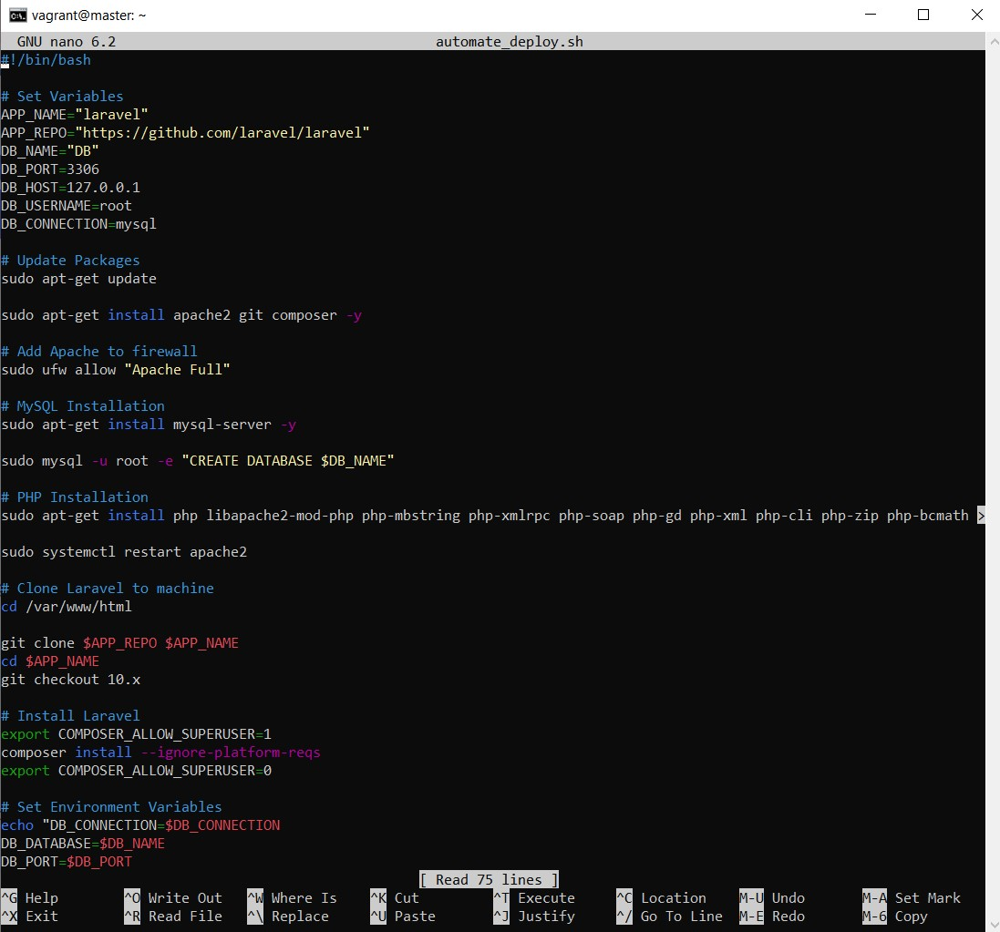

# Cloud Engineering Second Semester Examination Project

## Automate the provisioning of two Ubuntu-based servers, named “Master” and “Slave”, using Vagrant.
  * 

## On the Master node, create a bash script to automate the deployment of a LAMP (Linux, Apache, MySQL, PHP) stack.
  * 
  * 

## This script should:
      Clone a PHP application from GitHub.
  

      Install all necessary packages.
  

      Configure Apache web server.
  

      Configure MySQL.
  * 
  * 

---

## Using an Ansible playbook:

     Execute the bash script on the Slave node and verify that the PHP application is accessible through the VM’s IP address (take screenshot of this as evidence)
* 
* 
* 
* 

     Create a cron job to check the server’s uptime every 12 am.
* 